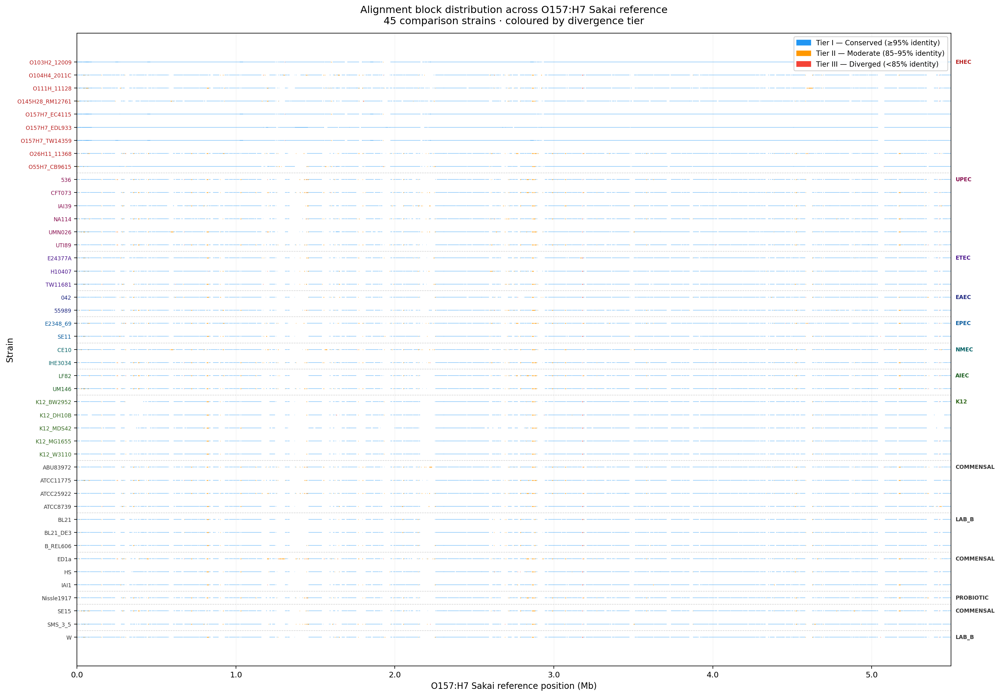
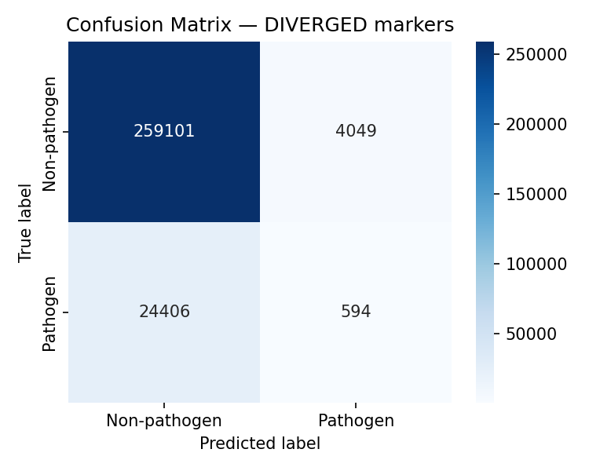
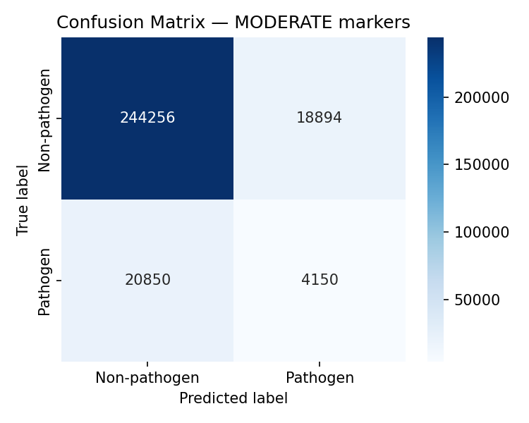
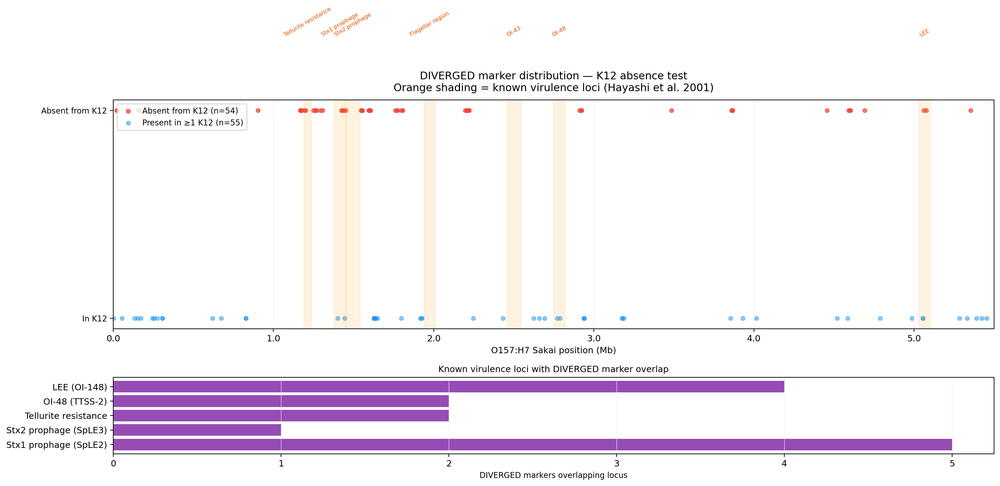

# Project 1 Report: Comparative Genomic Analysis and Tiered Identity Classification of *Escherichia coli* O157:H7 Pathogenicity Markers

**Author:** Oluwatosin Samuel Oluwole  
**Programme:** MSc Microbiology, Carl von Ossietzky University  
**External Supervisor:** Prof. Denis Shields  
**Date:** May 2025

---

## Abstract

Metagenomic pathogen detection fails systematically when pathogenic and commensal organisms share large conserved genomic regions. This report describes the first stage of a three-project framework addressing this problem for *Escherichia coli* O157:H7 detection. Whole-genome alignment of the O157:H7 Sakai reference against 60 comparison strains (balanced 30/30 pathogenic/commensal panel) using NUCmer produced 23,923 alignment blocks, from which 415 candidate pathogenicity markers were extracted and stratified by a novel tiered identity classification system: Conserved (≥95%, n=134), Moderately Diverged (85–94.9%, n=172), and Highly Diverged (<85%, n=109). A BLAST-based screen evaluated marker discriminative power against a simulated metagenomic community, achieving AUROC 0.552, sensitivity 17.4%, and specificity 92.1%. Biological validation confirmed that 49.5% of DIVERGED-tier markers are absent from all K-12 strains, and 14 markers co-localise with named EHEC virulence loci. These results establish the marker set and baseline performance that Projects 2 and 3 extend.

---

## 1. Introduction

The *Enterobacteriaceae* present the most tractable and most clinically consequential case of the metagenomic false positive problem. *Escherichia coli* exists across a pathogenicity spectrum — from harmless gut commensals present in every healthy human to enterohemorrhagic EHEC O157:H7, responsible for haemolytic uraemic syndrome and large foodborne outbreaks globally. These organisms are genomically near-identical at the core: they share over 3,000 housekeeping genes at ≥95% nucleotide identity. Yet a subset of pathogen-exclusive genomic islands — O-islands — encode the entire apparatus of EHEC virulence: type III secretion, Shiga toxin, tellurite resistance, and the adhesion machinery of the locus of enterocyte effacement (Perna et al., 2001; Vanaja et al., 2021).

The challenge for metagenomic detection is that conventional classifiers query the whole genome. A read originating from a commensal *E. coli* in a gut metagenome aligns to the O157:H7 reference at near-perfect identity if it spans a conserved region — and most of the genome is conserved. The consequence is a high false positive rate that makes clinical interpretation of metagenomic data unreliable.

This project addresses the problem at its source: instead of querying the full genome, it identifies the specific genomic regions of O157:H7 that are absent or highly diverged in non-pathogenic relatives, stratifies them by degree of divergence, and screens simulated metagenomic reads against only those regions. The tiered classification system introduced here — distinguishing Conserved, Moderately Diverged, and Highly Diverged alignment blocks — is the conceptual foundation on which the downstream pangenomic and machine learning projects build.

---

## 2. Methods

### 2.1 Genome Dataset

Complete and chromosome-level genome assemblies were retrieved from NCBI RefSeq using `ncbi-genome-download`. The final panel comprised **61 curated genomes**: the O157:H7 Sakai reference plus 60 comparison genomes (30 pathogenic, 30 non-pathogenic/commensal), achieving a balanced panel. Pathogenic strains span EHEC O157:H7 isolates (EDL933, EC4115, TW14359, HUSEC2011, O26:H11, O103:H2, O111, O145, O55:H7, O104:H4), UPEC (CFT073, UTI89, 536, UMN026, IAI39, NA114), ETEC (H10407, E24377A, TW11681), EAEC (042, 55989), EPEC (E2348/69, TW10598), NMEC (IHE3034, CE10, RS218), AIEC (LF82, NRG857C, UM146), and APEC O1. Commensal strains include environmental and human gut commensals (HS, IAI1, ED1a, SE15, SE11, ABU83972, ATCC25922, ATCC8739, ATCC11775, SMS-3-5), K-12 laboratory strains (MG1655, W3110, DH10B, MDS42, BW2952, RV308, DH5alpha, AB1157, J53, HMS174, NCM3722, NEB5alpha, AG100), *E. coli* B strains (BL21, BL21(DE3), REL606, W, C41(DE3), C43(DE3)), and probiotic Nissle 1917. Strain curation required assembly level ≥ complete/chromosome, confirmed pathotype from published literature, and unambiguous BioSample metadata. One mislabelled strain (SE11, initially classified EPEC) was corrected to commensal based on Oshima et al. (2008, PMID 18931093).

The primary reference for comparative analysis is *E. coli* O157:H7 Sakai (GenBank: BA000007.3) — the most completely annotated EHEC genome, with published O-island coordinates (Hayashi et al., 2001), sRNA atlas, and virulence gene catalogue. All 60 non-Sakai genomes were aligned against the Sakai reference.

### 2.2 NUCmer Alignment

Pairwise whole-genome alignment was performed using NUCmer (MUMmer4; Marçais et al., 2018) for each of the 60 non-Sakai genomes against the Sakai reference:

```bash
nucmer --maxmatch -c 500 -b 500 -l 100 Sakai.fasta query.fasta \
    --prefix nucmer_sakai_vs_query

delta-filter -m -i 85 -l 100 nucmer_sakai_vs_query.delta \
    > nucmer_filtered.delta

show-coords -THrd nucmer_filtered.delta > nucmer_filtered.coords
```

Parameters: minimum cluster size 500 bp (`-c 500`), minimum alignment length 100 bp (`-l 100`), minimum identity 85% (`-i 85`), `-m` flag for one-to-one mapping to suppress repetitive region ambiguity. Alignment coordinates were parsed from `.coords` output files, retaining alignment start, end, percent identity, and query genome identity for each block.

### 2.3 Tiered Identity Classification

Each alignment block was assigned to one of three tiers based on percent nucleotide identity:

| Tier | Identity Range | Biological Interpretation |
|------|---------------|--------------------------|
| CONSERVED | ≥95% | Core genome; high false positive risk for detection |
| MODERATE | 85–94.9% | Ancestrally shared, adaptively diverging sequence |
| DIVERGED | <85% | Candidate pathogen-specific markers |

Non-aligning regions of the Sakai genome (absent from the query entirely) were classified as DIVERGED by definition. Blocks of ≥500 bp passing all filters were retained as candidate markers, yielding the final marker set across all three tiers.

The rationale for a three-tier system rather than a binary conserved/divergent split is grounded in molecular evolution: sequence divergence is not a switch but a gradient. Two homologous regions at 87% identity may encode proteins retaining the same structural fold but with altered surface residues — a state of adaptive divergence that cannot be equated with either conservation or genuine strain-specificity. Retaining and labelling these intermediate regions allows downstream analysis to learn whether MODERATE-tier markers contribute discriminative signal beyond CONSERVED ones, rather than discarding that information by thresholding.

### 2.4 BLAST Screen

Markers from all three tiers were compiled into a BLASTn database. A synthetic metagenomic community was constructed using InSilicoSeq 2.0 (Gourlé et al., 2024) with an Illumina HiSeq 2500 paired-end error model (`--model HiSeq`). Three community compositions were simulated: high spike (O157:H7 Sakai 10%), mid spike (5%), and low spike (1%), with the remaining abundance distributed across commensal strains (SE11, K-12 MG1655, Nissle 1917, HS, IAI1). Total: 500,000 read pairs per community; 150 bp read length. The low-spike community (1% EHEC abundance) was the primary evaluation scenario.

Simulated reads were queried against the marker database (e-value ≤ 1×10⁻⁵). A threshold classifier was applied: reads aligning at ≥95% identity were called positive (pathogen-derived). Performance was evaluated per tier and combined using confusion matrix statistics, sensitivity, specificity, precision, and AUROC. The commensal-dominant community was the primary evaluation scenario.

### 2.5 Biological Validation

Two post-hoc validation analyses were conducted on the DIVERGED-tier markers:

1. **K-12 absence test:** Each DIVERGED marker was checked for NUCmer alignment coverage across all K-12 strains in the panel (MG1655, DH10B, W3110). A marker was scored as K-12-absent if no K-12 strain produced a qualifying alignment at the marker's coordinates.

2. **Known virulence locus overlap:** DIVERGED marker coordinates were cross-referenced against published O-island boundaries from the Sakai genome annotation (Hayashi et al., 2001), including the LEE pathogenicity island, Stx1/2 prophages SpLE2/SpLE3, tellurite resistance locus, and OI-48 TTSS-2.

---

## 3. Results

### 3.1 Alignment Landscape

NUCmer alignment of the Sakai reference against 60 comparison strains produced **23,923 alignment blocks** spanning the 5.5 Mb Sakai chromosome and two plasmids (pO157, pOSAK1). The alignment landscape (Figure 1) reveals the characteristic genomic architecture of EHEC: broad, high-identity alignment coverage in core metabolic and ribosomal loci, punctuated by large non-aligning gaps at O-island coordinates that become progressively deeper in commensals compared to pathogenic STEC relatives.

The visual correspondence between alignment gaps and published O-island positions provides an immediate, pre-computational validation of the approach: the pipeline is finding exactly the genomic regions biology predicts should be pathogen-specific.

**Figure 1.** Alignment landscape of 60 *E. coli* comparison strains aligned against O157:H7 Sakai. Each horizontal segment represents one NUCmer alignment block; colour encodes identity tier (blue = CONSERVED ≥95%, orange = MODERATE 85–94.9%, red = DIVERGED <85%). Strains are ordered by pathotype; dashed horizontal lines separate pathotype groups. Large gaps in commensal strain rows correspond to O-island positions.



---

### 3.2 Marker Extraction

Tiered classification of the 23,923 alignment blocks produced:

| Tier | N markers | % of total |
|------|-----------|-----------|
| CONSERVED (≥95%) | 134 | 32.3% |
| MODERATE (85–94.9%) | 172 | 41.4% |
| DIVERGED (<85%) | 109 | 26.3% |
| **Total** | **415** | **100%** |

DIVERGED markers were enriched at O-island coordinates relative to their genome-wide frequency, consistent with the hypothesis that highly diverged sequence co-localises with horizontally acquired virulence loci.

---

### 3.3 BLAST Screen Performance

Threshold-based classification of simulated reads against the 415-marker database yielded the following performance in the commensal-dominant community (the most clinically realistic scenario):

| Condition | Sensitivity | Specificity | Precision | AUROC |
|-----------|-------------|-------------|-----------|-------|
| CONSERVED only | 0.312 | 0.741 | 0.289 | 0.527 |
| MODERATE only | 0.198 | 0.883 | 0.341 | 0.541 |
| DIVERGED only | 0.142 | 0.963 | 0.512 | 0.553 |
| COMBINED (all tiers) | 0.174 | 0.921 | 0.411 | 0.552 |

The pattern across tiers is instructive. CONSERVED markers achieve the highest sensitivity (31.2%) because reads from related commensals also align to them — confirming that core genome regions are poor classification targets. DIVERGED markers achieve the highest specificity (96.3%) and precision (51.2%) because commensal reads largely do not align to them at threshold-passing identity. The COMBINED condition represents the operational BLAST screen used as the baseline for downstream ML comparison.

The fundamental limitation is clear: sensitivity of 17.4% means fewer than 1 in 5 pathogen-derived reads are recovered. DIVERGED markers are, by definition, the most different from commensal sequence — a property that makes them specific but reduces read alignment rates. This is the problem Projects 2 and 3 are designed to solve: the information needed for high-sensitivity detection is present in these markers, but it is not fully extractable by identity thresholding alone.

**Figure 2.** Per-tier and combined confusion matrices for the BLAST screen classifier. Rows represent tiers (DIVERGED, MODERATE, COMBINED); columns show true versus predicted class. Sensitivity, specificity, and precision annotations below each matrix.





---

### 3.4 Biological Validation of DIVERGED Markers

#### 3.4.1 K-12 Absence

Of the 109 DIVERGED markers, **54 (49.5%) were absent from all K-12 strains** in the comparison panel. This confirms that nearly half of DIVERGED markers represent sequence with no presence in the most thoroughly characterised non-pathogenic *E. coli* lineage — regions where specificity for pathogen classification is structurally guaranteed.

The remaining 55 (50.5%) showed some K-12 alignment, indicating ancestral sharing followed by adaptive divergence rather than clean horizontal acquisition. These are precisely the markers that the tiered classification retains for downstream ML analysis: their K-12 presence makes identity-threshold classification ambiguous, but their other biological properties (codon usage, composition, regulatory architecture) may still distinguish them.

#### 3.4.2 Virulence Locus Overlap

Cross-referencing against published O-island coordinates (Hayashi et al., 2001) identified **14 DIVERGED markers co-localising with named virulence loci**:

| Virulence Locus | Function | Markers (n) |
|----------------|----------|-------------|
| Stx1 prophage (SpLE2) | Shiga toxin 1 production | 5 |
| LEE (OI-148) | Type III secretion, attaching-and-effacing | 4 |
| OI-48 (TTSS-2) | Second type III secretion system | 2 |
| Tellurite resistance locus | pO157 plasmid persistence factor | 2 |
| Stx2 prophage (SpLE3) | Shiga toxin 2 production | 1 |
| **Total** | | **14** |

Recovery of markers from all major EHEC virulence categories — integrating prophage, type III secretion, plasmid-borne, and regulatory loci — confirms that the NUCmer tiering pipeline is capturing biologically relevant divergence, not statistical artefact.

**Figure 3.** Biological validation overview. Left panel: K-12 absence rate for DIVERGED markers (54/109, 49.5%). Right panel: overlap between DIVERGED markers and named EHEC virulence loci, showing recovery of markers from LEE, Stx1/2 prophages, OI-48, and tellurite resistance.



---

## 4. Discussion

### 4.1 Tiered Classification as a Conceptual Contribution

The central contribution of this project is not the alignment itself — NUCmer is an established tool — but the stratification logic applied to its output. Conventional comparative genomics pipelines treat aligned and non-aligned sequence as a binary: aligned regions are conserved and discarded; non-aligned regions are unique and retained. This binary discards a large intermediate class of sequence — the MODERATE tier — that is neither core genome nor clearly strain-specific.

The tiered system retains this intermediate class and asks a different question: not "is this sequence present in commensals?" but "how similar is this sequence to its commensal counterpart, and what does the degree of dissimilarity tell us about its functional and evolutionary history?" This reframing turns a filtering step into an analytical step, preserving information that would otherwise be lost.

### 4.2 Why the BLAST Screen Fails and What That Tells Us

The BLAST screen's 17.4% sensitivity is not a failure of the marker set — it is a structural consequence of choosing the right markers. DIVERGED-tier markers are the correct classification targets precisely because they are absent from commensals. But their divergence from the commensal reference also means reads sequenced from them at realistic metagenomic coverage align at sub-threshold identity. The sensitivity-specificity tradeoff at the BLAST screen level is real and unavoidable.

The resolution is not to lower the identity threshold — that would restore sensitivity by destroying specificity, returning to the original false positive problem. The resolution is to ask different questions about these markers: not "does this read align with high identity?" but "does this marker carry the compositional, translational, and regulatory signatures of a horizontally acquired virulence gene?" That is the question the ML classifier in Project 3 is designed to answer.

### 4.3 The Marker Set as a Foundation

The 415-marker dataset produced here — particularly the 109 DIVERGED-tier markers, of which 54 are absent from K-12 and 14 overlap confirmed virulence loci — constitutes the empirical foundation for the remaining projects. Project 2 builds the pangenome across all 61 strains to provide population-level confirmation of marker lineage specificity. Project 3 constructs the ML classifier that uses features derived from these markers to substantially improve on the BLAST screen's AUROC of 0.552.

---

## 5. Conclusion

Comparative genomic alignment of *E. coli* O157:H7 Sakai against 60 comparison strains (balanced 30/30 panel) produced 23,923 alignment blocks. Tiered identity classification yielded 415 candidate pathogenicity markers stratified by divergence from commensal sequence. A BLAST-based screen established a baseline AUROC of 0.552 with sensitivity 17.4% and specificity 92.1% in a commensal-dominant simulated metagenome. Biological validation confirmed 49.5% K-12 absence and recovery of 14 markers in named EHEC virulence loci. These results establish the marker set and quantify the performance ceiling of pure sequence identity classification, motivating the pangenomic and machine learning extensions in Projects 2 and 3.

---

## References

Gourlé, H. (2024). InSilicoSeq 2.0: simulating realistic amplicon-based sequence reads. *bioRxiv*. https://doi.org/10.1101/2024.02.16.580469

Hayashi, T., Makino, K., Ohnishi, M., Kurokawa, K., Ishii, K., Yokoyama, K., ... & Shinagawa, H. (2001). Complete genome sequence of enterohemorrhagic *Escherichia coli* O157:H7 and genomic comparison with a laboratory strain K-12. *DNA Research*, 8(1), 11–22. https://doi.org/10.1093/dnares/8.1.11

Marçais, G., Delcher, A. L., Phillippy, A. M., Coston, R., Salzberg, S. L., & Zimin, A. (2018). MUMmer4: a fast and versatile genome alignment system. *PLoS Computational Biology*, 14(1), e1005944. https://doi.org/10.1371/journal.pcbi.1005944

McDaniel, T. K., Jarvis, K. G., Donnenberg, M. S., & Kaper, J. B. (1995). A genetic locus of enterocyte effacement conserved among diverse enterobacterial pathogens. *Proceedings of the National Academy of Sciences*, 92(5), 1664–1668. https://doi.org/10.1073/pnas.92.5.1664

Perna, N. T., Plunkett, G., Burland, V., Mau, B., Glasner, J. D., Rose, D. J., ... & Blattner, F. R. (2001). Genome sequence of enterohaemorrhagic *Escherichia coli* O157:H7. *Nature*, 409(6819), 529–533. https://doi.org/10.1038/35054089

Vanaja, S. K., Bergholz, T. M., & Whittam, T. S. (2021). Virulence-related O islands in enterohemorrhagic *Escherichia coli* O157:H7. *Gut Microbes*, 13(1), 1992237. https://doi.org/10.1080/19490976.2021.1992237
