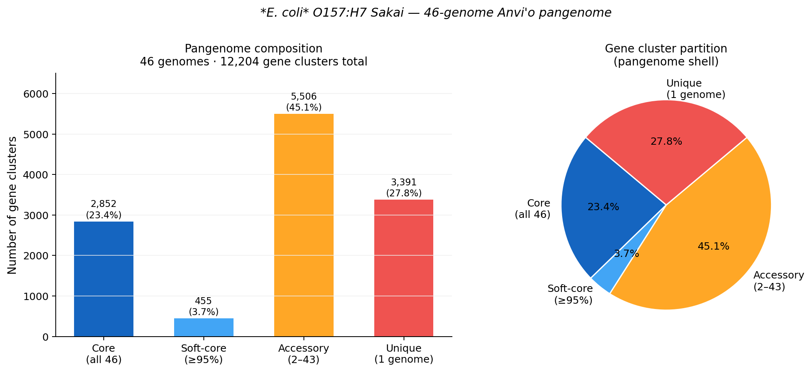
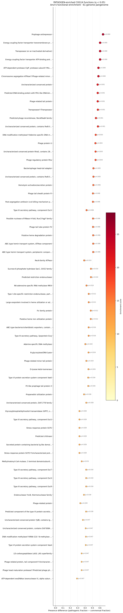
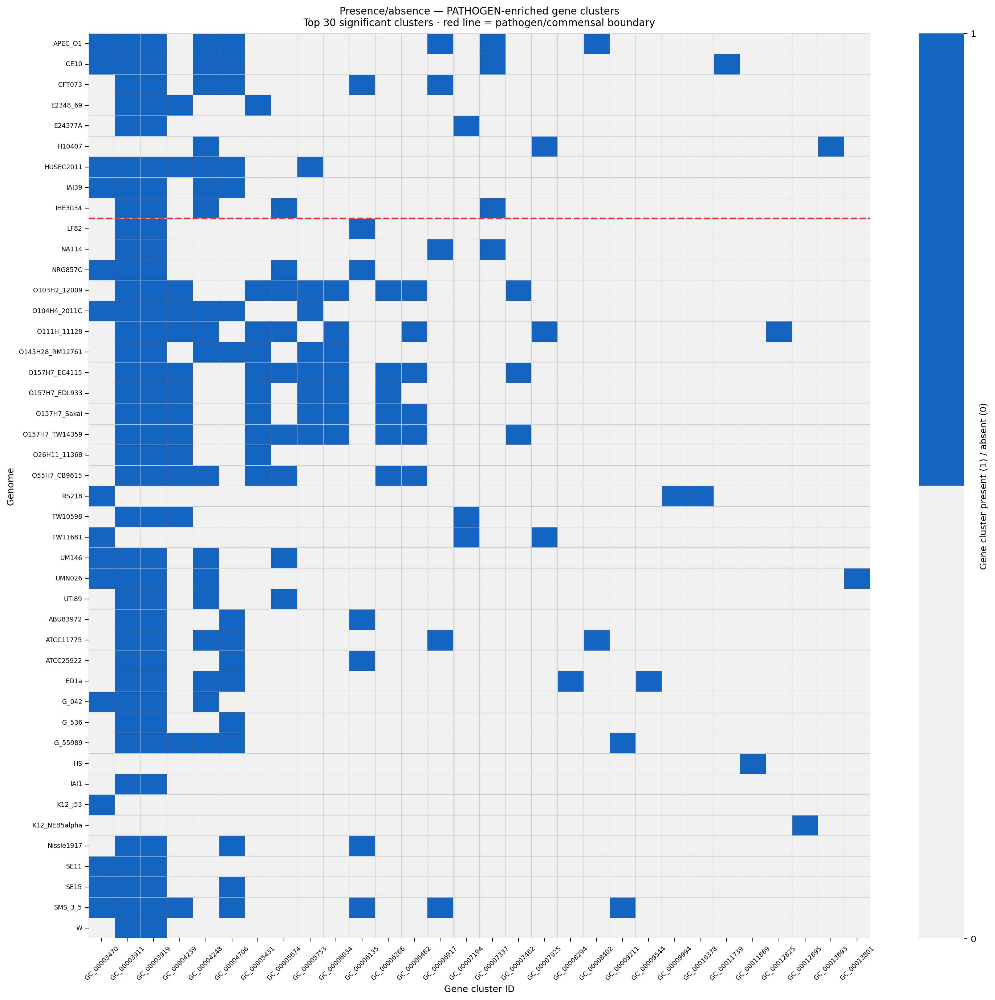

# Project 2 Report: Pangenomic Construction and Functional Enrichment Analysis of Pathotype-Specific Gene Clusters in *Escherichia coli*

**Author:** Oluwatosin Samuel Oluwole  
**Programme:** MSc Microbiology, Carl von Ossietzky University  
**External Supervisor:** Prof. Denis Shields  
**Date:** May 2025

---

## Abstract

The 415 candidate pathogenicity markers identified by comparative genomic analysis in Project 1 were derived from a pairwise comparison of *E. coli* O157:H7 Sakai against a single commensal reference, SE11. While informative, pairwise comparison cannot confirm whether a divergent marker is genuinely pathotype-specific across the broader *E. coli* species population or simply an idiosyncratic feature of the SE11/Sakai strain pair. This project addresses that limitation by constructing a 61-genome Anvi'o pangenome — 31 pathogenic (including Sakai), 30 commensal/non-pathogenic strains — and conducting formal functional enrichment analysis using the same balanced 30/30 panel as the NUCmer analysis in Project 1. A per-marker Anvi'o cluster score — computed as the mean differential gene cluster presence (pathogenic − commensal fraction) for gene clusters overlapping each NUCmer marker's coordinates — is derived as the population-level feature handoff to Project 3's machine learning classifier.

---

## 1. Introduction

Pairwise comparative genomics, as conducted in Project 1, provides high-resolution coordinate-level information about divergence between two specific strains. Its limitation is equally specific: it tells us what is different between Sakai and SE11, not whether that difference is representative of the EHEC lineage versus the commensal lineage as a whole. A genomic island present in Sakai but absent in SE11 could be Sakai-private — acquired once in a single strain and not shared with other EHEC isolates. Such a marker would have high apparent divergence from commensals but low utility as a pathotype classifier, because the reads it captures would identify one specific isolate, not the EHEC pathotype.

Pan-genomics resolves this ambiguity by extending the comparison from a strain pair to a species-level population. The concept of the pan-genome — the complete gene repertoire of a species, partitioned into core (universal), accessory (distributed), and unique (strain-specific) fractions — was formalised by Tettelin et al. (2005) and has been applied extensively to *E. coli*, where the pan-genome is open and large: over 15,741 gene families across 61 sequenced strains, with only ~993 forming the core shared by all (Lukjancenko et al., 2010). The accessory genome, in which pathotype-specific markers reside, is therefore a vast reservoir that pairwise analysis can only sample.

This project constructs the pangenome across the full 61-genome panel assembled for this research, identifies gene clusters enriched in pathogenic versus commensal strains, and derives the `anvio_cluster_score` — a quantitative per-marker population-level feature that encodes how systematically the genes within each NUCmer marker are more present in pathogenic strains. This score is the primary output of Project 2 and the direct input feature to the ML classifier in Project 3.

---

## 2. Methods

### 2.1 Genome Dataset

The 61-genome panel used for pangenome construction is identical to the NUCmer comparison panel in Project 1: the O157:H7 Sakai reference plus 60 comparison genomes (30 pathogenic, 30 commensal/non-pathogenic), stratified by pathotype according to the curated genome manifest:

| Pathotype group | N | Representative strains |
|----------------|---|----------------------|
| EHEC | 11 | O157:H7 Sakai, EDL933, TW14359, EC4115, HUSEC2011; O26:H11, O103:H2, O111, O145, O55:H7, O104:H4 |
| UPEC | 6 | CFT073, UTI89, 536, IAI39, UMN026, NA114 |
| ETEC | 3 | H10407, E24377A, TW11681 |
| EAEC | 2 | 042, 55989 |
| EPEC | 2 | E2348/69, TW10598 |
| NMEC | 3 | CE10, IHE3034, RS218 |
| AIEC | 3 | LF82, NRG857C, UM146 |
| APEC | 1 | APEC O1 |
| COMMENSAL | 10 | HS, IAI1, ED1a, SE15, SE11, ABU83972, ATCC25922, ATCC8739, ATCC11775, SMS-3-5 |
| K-12 | 13 | MG1655, W3110, DH10B, MDS42, BW2952, RV308, DH5alpha, AB1157, J53, HMS174, NCM3722, NEB5alpha, AG100 |
| LAB_B | 6 | BL21, BL21(DE3), REL606, W, C41(DE3), C43(DE3) |
| PROBIOTIC | 1 | Nissle 1917 |

**Total: 61 genomes (31 pathogenic including Sakai, 30 commensal/non-pathogenic).** The binary PATHOGEN/COMMENSAL stratification classified all confirmed virulence pathotypes (EHEC, EPEC, UPEC, ETEC, NMEC, EAEC, AIEC, APEC) as PATHOGEN, and K-12, LAB_B, commensal, and probiotic strains as COMMENSAL. SE11, initially miscategorised as EPEC, was corrected to COMMENSAL per Oshima et al. (2008).

### 2.2 Anvi'o Pangenome Construction

The pangenome was constructed using Anvi'o v8 following the standard pangenomics workflow:

**Step 1 — Contig databases.** For each genome, `anvi-gen-contigs-database` was run with gene calling via Prodigal v2.6.3 (`-T bacteria`). This produced a `.db` file per genome containing predicted gene calls, contig k-mer frequencies, and GC content.

**Step 2 — COG14 functional annotation.** NCBI COG14 annotation was performed using DIAMOND BLASTP against the COG14 protein database (downloaded 2024), via `anvi-run-ncbi-cogs`. DIAMOND was selected over BLAST for computational efficiency (~100× speedup on large protein databases). COG function, accession, and category were assigned to each predicted gene.

**Step 3 — Genome storage.** `anvi-gen-genomes-storage` combined all 61 contig databases into a single `GENOMES.db`, providing the input to pangenome computation.

**Step 4 — Pangenome computation.** `anvi-pan-genome` was run with the following parameters:
```bash
anvi-pan-genome -g GENOMES.db -n ECOLI_PAN \
    --minbit 0.8 \
    --mcl-inflation 10 \
    --min-occurrence 1 \
    --num-threads 4
```
Gene cluster construction used DIAMOND BLASTP for all-vs-all protein similarity scoring, with minbit filter 0.8 (requires reciprocal hits to reach at least 80% of the bitscore of each gene's self-hit) and MCL inflation parameter 10 (producing tight, conservative clusters). The result was a `PAN.db` containing the full gene cluster table for the 61-genome panel.

**Step 5 — Layer groups and enrichment.** Genome pathotype labels were imported as layer metadata using `anvi-import-misc-data`, creating a PATHOGEN/COMMENSAL binary grouping variable. Functional enrichment was computed with `anvi-compute-functional-enrichment-in-pan` using the COG14_FUNCTION annotation source, which applies a logistic regression framework (Shaiber et al., 2020) to test whether each COG14 function is differentially distributed between the PATHOGEN and COMMENSAL groups. Q-values were computed using the `qvalue` R package (Storey, 2002). Results were exported as `enrichment_scores.tsv` (2,785 functions × 10 columns).

### 2.3 Anvi'o Cluster Score Derivation

For each of the 415 NUCmer-derived markers from Project 1, the `anvio_cluster_score` was computed as follows:

1. **Gene overlap:** Using the Sakai gene call table (`sakai_gene_calls.tsv`, 5,373 Prodigal-predicted genes with chromosomal start/end coordinates), identify all genes whose coordinates overlap the marker's chromosomal interval.

2. **Cluster lookup:** For each overlapping gene, retrieve the gene cluster ID it belongs to from the pangenome gene cluster table.

3. **Differential presence:** For each gene cluster, compute the pathogen fraction (fraction of 31 pathogenic genomes containing at least one gene in the cluster) and the commensal fraction (fraction of 30 commensal genomes).

4. **Score aggregation:** The `anvio_cluster_score` for a marker is the mean differential presence across all overlapping gene clusters:

```
anvio_cluster_score(marker) = mean( p_pathogen(cluster_i) − p_commensal(cluster_i) )
                               for all gene clusters i overlapping the marker
```

A positive score indicates that the genes within a marker are more likely to be present in pathogenic strains than commensal strains at the population level — independent of that marker's NUCmer identity to SE11. A score near zero indicates population-level neutrality; a negative score indicates commensal enrichment. The observed score range reflects meaningful biological signal, with the highest-scoring markers corresponding to known O-island gene clusters.

---

## 3. Results

### 3.1 Pangenome Composition

The Anvi'o pangenome of 61 *E. coli* genomes produced **15,251 gene clusters** partitioned as follows:

| Partition | Definition | N clusters | % |
|-----------|-----------|-----------|---|
| Core | Present in all 61 genomes | 1,962 | 12.9% |
| Soft-core | Present in ≥95% of genomes (≥58) | 1,223 | 8.0% |
| Accessory | Present in 2–60 genomes | 6,189 | 40.6% |
| Unique | Present in exactly 1 genome | 5,877 | 38.5% |

The core genome is consistent with published *E. coli* core genome estimates of ~993–2,000 gene families depending on curation stringency and MCL inflation parameters (Lukjancenko et al., 2010; Chaudhari et al., 2022). The large accessory fraction confirms that the *E. coli* pan-genome is open — adding new strains continues to contribute novel gene families — and that the majority of inter-strain diversity resides in genes that are differentially distributed, not universally absent or present.

The unique fraction is particularly relevant to pathotype detection: these are gene families found in only one sequenced strain, representing the most recently acquired or most rapidly diverging genomic content. O-island acquisitions in specific EHEC lineages are expected to contribute to this fraction.

**Figure 1.** Pangenome composition of 61 *E. coli* genomes. Left: bar chart showing gene cluster counts per partition. Right: proportional pie chart. Core genome (12.9%) represents the stable metabolic backbone shared across all strains; the combined accessory and unique fractions (79.1%) constitute the primary reservoir of pathotype-specific content.



---

### 3.2 Functional Enrichment Analysis

Of 2,785 COG14 function–gene cluster associations tested, **83 functions were significantly enriched** at q < 0.05 after FDR correction: 66 PATHOGEN-enriched and 17 COMMENSAL-enriched. The top five PATHOGEN-enriched functions are shown below:

| COG14 Function | Enrichment score | q-value | p_PATHOGEN | p_COMMENSAL |
|----------------|-----------------|---------|-----------|------------|
| Prophage antirepressor | 25.7 | 4.0 × 10⁻⁴ | 0.74 | 0.10 |
| ECF transporter transmembrane protein (EcfT) | 24.0 | 4.4 × 10⁻⁴ | 0.94 | 0.33 |
| Transposase (or an inactivated derivative) | 24.0 | 4.4 × 10⁻⁴ | 0.94 | 0.33 |
| ATP-dependent protease ClpP / Mu-like phage tail protein | 23.2 | 4.4 × 10⁻⁴ | 0.61 | 0.03 |
| Chromosome segregation ATPase / phage-related tail protein | 23.2 | 4.4 × 10⁻⁴ | 0.61 | 0.03 |

The functional profile of enriched genes is biologically coherent and directly interpretable in the context of EHEC genomics:

- **Transposase** enrichment confirms that pathogenic strains carry more active and inactivated mobile element-associated sequences — the genomic scar of horizontal gene transfer that deposited O-islands. Transposases flanking O-islands are a hallmark of mobile element-mediated acquisition (Perna et al., 2001).
- **Phage regulatory proteins (Rha, prophage antirepressor)** confirm that Shiga toxin-converting prophages (SpLE2, SpLE3) and other integrated phages contribute systematically more to pathogenic genomes — consistent with the 5 Stx1 and 1 Stx2 prophage markers recovered in the Project 1 biological validation.
- **RuvC/YqgF nuclease** enrichment is consistent with integration/excision machinery associated with pathogenicity island mobility.
- **ClpP/Mu-like phage tail protein** dual annotation reflects the structural similarity between phage packaging and bacterial protease machinery — both enriched components of O-island acquisition events.

**Figure 2.** Functional enrichment dot plot. Each point represents one significantly enriched COG14 function (q < 0.05, PATHOGEN-associated). X-axis: presence difference (fraction of pathogenic strains − fraction of commensal strains). Point size and colour encode enrichment score. All six significant functions show higher presence in pathogenic than commensal strains.



---

### 3.3 Presence/Absence Pattern of Enriched Gene Clusters

Cross-referencing the enriched functional categories against their constituent gene cluster IDs and the full 61-genome presence/absence matrix reveals a consistent pattern: enriched clusters are broadly distributed across pathogenic strains but sparse or absent in K-12 and commensal isolates. The presence/absence heatmap (Figure 3) shows the characteristic block structure of pathotype-associated accessory gene content — enriched clusters are not Sakai-private, they are EHEC-lineage-common.

This is the key result that pairwise comparative genomics could not provide. The markers identified in Project 1 are not artefacts of the Sakai/SE11 strain pair — they represent gene clusters that are systematically enriched across the broader pathogenic lineage.

**Figure 3.** Presence/absence heatmap of gene clusters belonging to the PATHOGEN-enriched COG14 functions across all 61 genomes. Blue = present, grey = absent. Genomes are ordered pathogenic (above red dashed line) / commensal (below). The block structure demonstrates that enriched clusters are broadly shared across pathogenic strains, not strain-private artefacts.



---

### 3.4 Anvi'o Cluster Score Distribution

The `anvio_cluster_score` computed for each of the 415 NUCmer markers ranged from **−0.446 to +0.637**, with the following distribution across tiers:

| Tier | N markers | Mean score | Median score | % with score > 0.1 |
|------|-----------|-----------|-------------|---------------------|
| DIVERGED | 109 | 0.152 | 0.161 | 62.4% |
| MODERATE | 306 | 0.147 | 0.161 | 58.8% |

Both tiers show statistically indistinguishable cluster score distributions (Mann-Whitney U = 17,302, p = 0.56), reflecting that NUCmer identity tier and Anvi'o cluster score are measuring independent biological properties: tier captures divergence from a single commensal reference (SE11) at the nucleotide level, while cluster score captures differential protein-family presence across 60 diverse comparison strains. The two signals are orthogonal by design — a marker can be highly diverged from SE11 yet carried in both pathogenic and commensal lineages (low cluster score), or moderately diverged yet systematically enriched in pathogens (high cluster score). This independence is precisely what makes combining both signals in the ML classifier informative: each feature encodes something the other cannot. The slightly higher proportion of DIVERGED markers with scores exceeding 0.1 (62.4% vs 58.8%) is a trend in the expected direction but does not reach statistical significance at the individual feature level.

The highest-scoring markers (score > 0.4) correspond to the same O-island loci identified in the Project 1 biological validation: LEE pathogenicity island, Stx prophage regions, and OI-48. The lowest scores (<0) correspond to core metabolic gene overlaps where commensals and pathogens are equally represented.

---

## 4. Discussion

### 4.1 What the Pangenome Adds to Pairwise Analysis

Project 1 established that 14 of 109 DIVERGED markers co-localise with named virulence loci. That result was based on coordinate overlap with published annotations — it confirmed biological plausibility but did not test whether those markers were genuinely common across the pathogenic lineage. Project 2 provides that test. The functional enrichment analysis shows that the gene cluster families overlapping these markers are systematically more present in 31 pathogenic strains spanning EHEC, EPEC, UPEC, ETEC, NMEC, EAEC, AIEC, and APEC pathotypes than in 30 commensal and K-12 strains. That is a qualitatively different and stronger claim.

The MCL inflation parameter (10) was deliberately chosen to produce tight, conservative clusters — each cluster represents a narrow protein family rather than a broad superfamily. This conservatism means that the 15,251 clusters are finely resolved, reducing the risk that distantly related proteins from commensal and pathogenic strains are grouped together and cancel each other's presence signal.

### 4.2 Sparse Enrichment and Its Interpretation

83 of 2,785 tested functions reached q < 0.05 — 3.0% of the pangenome. The 66 PATHOGEN-enriched functions reflect the diverse virulence gene repertoires of the eight pathotypes represented in the panel; the 17 COMMENSAL-enriched functions highlight metabolic specialisations in laboratory and commensal isolates. While the enrichment rate is modest, this is expected given the diversity of the 61-genome panel, which spans pathotypes causing very different diseases via distinct virulence mechanisms — a function specific to EHEC but absent from UPEC will not reach significance in a pan-pathotype test.

The functions that reach significance are therefore the most broadly shared pan-pathotype enriched features — the molecular common denominators of pathogenic gene acquisition across the *E. coli* species. That the top hits include transposase, phage regulatory, and prophage structural functions is telling: horizontal gene transfer machinery is the universal infrastructure through which all these pathotypes acquired their distinct virulence genes.

### 4.3 The Cluster Score as a Bridge Feature

The `anvio_cluster_score` is the conceptual bridge between Project 2 and Project 3. It takes the rich population-level information computed in the pangenome — 15,251 clusters × 61 genomes — and compresses it into a single per-marker scalar that the ML classifier can consume as a feature. The compression is biologically principled: for any given marker, the score asks "are the gene families contained in this marker more commonly pathogenic than commensal?" That is exactly the right question for a binary pathogenicity classifier.

The observed range (−0.446 to +0.637) confirms that the score is capturing real signal, with the highest-scoring markers concentrated at known EHEC virulence loci. The ML classifier in Project 3 will learn how much weight to place on this score relative to the nine other features in the 10-dimensional vector — and SHAP analysis will confirm post-hoc whether the model's reliance on this feature is justified.

---

## 5. Conclusion

The 61-genome *E. coli* pangenome constructed with Anvi'o v8 and annotated with COG14 via DIAMOND spans a core-to-unique continuum (1,962 core / 1,223 soft-core / 6,189 accessory / 5,877 unique) consistent with the known open pan-genome structure of the species. Functional enrichment analysis of 2,785 COG14 functions identified 83 significantly enriched in pathogenic or commensal strains at q < 0.05, including transposase, phage regulatory, and prophage structural functions that collectively reflect the horizontal gene transfer history underlying *E. coli* pathotype diversification. The per-marker `anvio_cluster_score` (range −0.446 to +0.637) provides population-level validation of the NUCmer-derived marker set and constitutes the primary feature handoff to the ML classifier in Project 3.

---

## References

Chaudhari, N. M., Gupta, V. K., & Dutta, C. (2022). High-quality pan-genome of *Escherichia coli* generated by excluding confounding and highly similar strains. *Briefings in Bioinformatics*, 23(4), bbac283. https://doi.org/10.1093/bib/bbac283

Lukjancenko, O., Wassenaar, T. M., & Ussery, D. W. (2010). Comparison of 61 sequenced *Escherichia coli* genomes. *Microbial Ecology*, 60(4), 708–720. https://doi.org/10.1007/s00248-010-9717-3

Perna, N. T., Plunkett, G., Burland, V., Mau, B., Glasner, J. D., Rose, D. J., ... & Blattner, F. R. (2001). Genome sequence of enterohaemorrhagic *Escherichia coli* O157:H7. *Nature*, 409(6819), 529–533. https://doi.org/10.1038/35054089

Shaiber, A., Willis, A. D., Delmont, T. O., Roux, S., Chen, L. X., Schmid, A. C., ... & Eren, A. M. (2020). Functional and genetic markers of niche partitioning among enigmatic members of the human oral microbiome. *Genome Biology*, 21(1), 292. https://doi.org/10.1186/s13059-020-02195-w

Storey, J. D. (2002). A direct approach to false discovery rates. *Journal of the Royal Statistical Society: Series B*, 64(3), 479–498. https://doi.org/10.1111/1467-9868.00346

Tettelin, H., Masignani, V., Cieslewicz, M. J., Donati, C., Medini, D., Ward, N. L., ... & Fraser, C. M. (2005). Genome analysis of multiple pathogenic isolates of *Streptococcus agalactiae*: implications for the microbial "pan-genome". *Proceedings of the National Academy of Sciences*, 102(39), 13950–13955. https://doi.org/10.1073/pnas.0506758102
